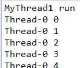

### Java多线程的创建以及启动
在Java中会经常用到多线程编程，例如如果需要执行一个比较耗时的任务（如Android开发中，网络操作必须创建线程，防止因主线程的等待加载资源导致界面崩溃），应该使用独立的线程。
通常有两种方式来创建线程（后文还有其他方法），一是让自定义类继承Thread类，二是让自定义类实现Runnable接口，实际上第一种方法的Thread类的源码也是实现了Runnable接口。
我们一般推荐采用第二种方法，可以避免由于Java的单继承特性带来的局限，面向接口编程在扩展性等方面比继承Thread好，而且更适合于资源共享（如经典的卖票案例）。
不要调用run方法，直接调用只会执行同一个线程中的任务，而不会启动新线程。
<!-- more -->
#### 继承Thread类，重写run方法
``` Java
public class MyThread extends Thread{

    //run()的方法体代表了线程需要完成的任务，称之为线程执行体。
    @Override
    public void run() {
	    for (int i = 0;i < 30; i++) {
	    	System.out.println(Thread.currentThread().getName() + " " + i);
	    	
			//静态方法sleep()会抛出InterruptedException异常
	    	try {
				Thread.sleep(100L);
			} catch (InterruptedException e) {
				e.printStackTrace();
			}
	    }
    }
}
```

#### 实现Runnable接口
``` Java
public class MyRunnable implements Runnable {

    //run()方法同样是线程执行体
	@Override
	public void run() {
	    for (int i = 0;i < 30; i++) {
	    	System.out.println(Thread.currentThread().getName() + " " + i);
	    	
	    	try {
				Thread.sleep(100L);
			} catch (InterruptedException e) {
				e.printStackTrace();
			}
	    }
	}

}
```

在主线程中启动两种方式实现的子线程
``` Java
public static void main(String[] args) throws InterruptedException {
	
	//继承thread类
	Thread thread0 = new MyThread();
	thread0.start();  //线程进入runnable状态
	
	//实现Runnable接口，创建Runnable实现类的实例，并以此实例作为Thread类的target来创建Thread对象，该Thread对象才是真正的线程对象
	Runnable myRunnable = new MyRunnable();
	Thread thread1 = new Thread(myRunnable);
	thread1.start();  //线程进入runnable状态
}
```

#### 第三种形式
我们注意到有两处地方可以定义我们的执行体内容，那么如果将它们以某种方式结合起来的话，会执行哪个任务呢，这也是创建线程的第三种形式
在代码中加入了打印信息，来帮助分辨程序究竟执行的是哪一个执行体
``` Java
public class MyThread1 extends Thread{

	//不继承父类的构造函数，只是调用而已
    public MyThread1 (Runnable runnable) {
		super(runnable);  //显示调用父类的有参构造函数
	}
	
    @Override
    public void run() {
    	System.out.println("MyThread1 run");
	    for (int i = 0;i < 30; i++) {
	    	System.out.println(Thread.currentThread().getName() + " " + i);
	    	
	    	try {
				Thread.sleep(100L);
			} catch (InterruptedException e) {
				e.printStackTrace();
			}
	    }
    }
}
MyRunnable1类与上面的MyRunnable类几乎无差别，只是加入了打印信息，代码就不贴出来了
主类：
public class ThreadTest1 {
    public static void main(String[] args) throws InterruptedException {
    	
    	Runnable myRunnable = new MyRunnable1();  
        Thread thread = new MyThread1(myRunnable);
        thread.start();  
    }
}
```
执行结果如下


通过输出我们知道线程执行体是MyThread1类中的run()方法。这是因为Thread类本身也是实现了Runnable接口，而run()方法最先是在Runnable接口中定义的方法。
对于Thread(Runnable target ...)，不管传入的Target是否为空，首先都会执行Thread自己的run()方法。如果重写了该方法且该方法中没有super.run()，那么是永远不会调用Runnable实现的run()方法；如果没有重写该方法，则会去判断target是否为空，以此来决定调用target实现的run()方法。


### 线程的类型
java中有两类线程，User Thread(用户线程，或者叫非守护线程)和Daemon Thread(守护线程)。
当jvm中没有用户线程时，jvm不会理会守护线程有没有在运行，jvm会停止所有守护线程，然后退出jvm。创建线程默认的是用户线程。守护线程可以用来为其他线程提供服务的，比如GC线程。
在我们的例子中，当main主线程（user thread）结束时，其他线程仍在运行，但是如果将其他线程设置为守护线程，main线程的结束意味着jvm也退出了。
方法：public final void setDaemon(boolean on) 可以设置线程是否为守护线程，但是必须在start之前调用，否则会抛出IllegalThreadStateException（这点与操作系统中的守护进程有所区别）；
守护线程中产生的线程也是守护线程；（守护进程fork()出来的子进程不再是守护进程）；
不是所有的用用都可以被分配到守护线程，如读写操作和计算逻辑等。因为这些操作可能没有完成，虚拟机就退出了；
方法：public final boolean isDaemon() 可以判断是否是守护线程

