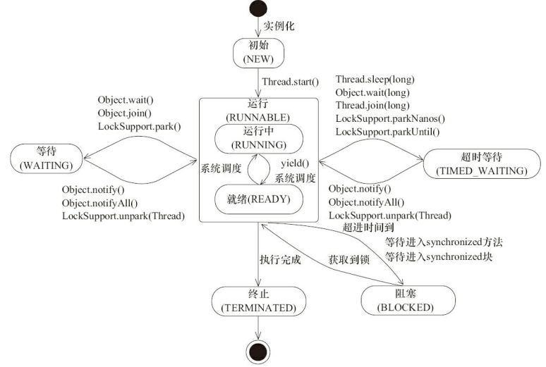

### 线程简单介绍
现代操作系统在运行一个程序时，会为其创建一个进程。例如，启动一个Java程序，操作系统就会创建一个Java进程。现代操作系统调度的最小单元是线程，也叫轻量级进程，在一个进程里可以创建多个线程，这些线程都拥有各自的计数器、栈和局部变量等属性，并且能够访问共享的堆内存变量。处理器在这些线程上高速切换，让使用者感觉到这些线程在同时执行。
多线程和多进程的本质区别在于每个进程拥有自己的一整套变量，而多线程则共享数据。
现代操作系统基本采用分时的形式调度运行的线程，操作系统会为每个线程分配时间片，当线程的时间片用完了就会发生线程调度，并等待着下次分配。线程分配到的时间片多少也就决定了线程使用处理器资源的多少，而线程优先级就是决定线程需要多或者少分配一些处理器资源的线程属性。
<!-- more -->
### 线程的状态
| 名称                 |  说明                                                                  |
|----------------------|------------------------------------------------------------------------|
|New(新创建)           |初始状态，线程被构建，但是还没有调用start方法                           |
|Runnable(可运行)      |调用start()方法，执行run()中的代码                                      |
|Blocked(被阻塞)       |阻塞状态，表示线程阻塞于锁                                              |
|Waiting(等待)         |等待状态，表示线程线程进入等待状态，进入该状态后需要其他线程做出通知动作|
|Time_Waiting(超时等待)|超时等状态状态，该状态与WAITING不同，它是可以在指定时间内自行返回的     |
|Terminated(终止)      |终止状态，表示当前线程已经执行完毕                                      |

### 状态转移图
